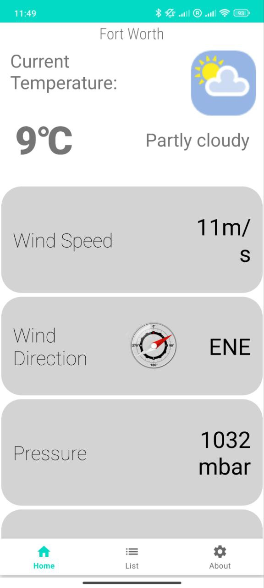
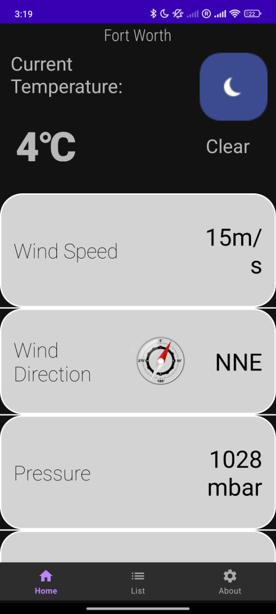
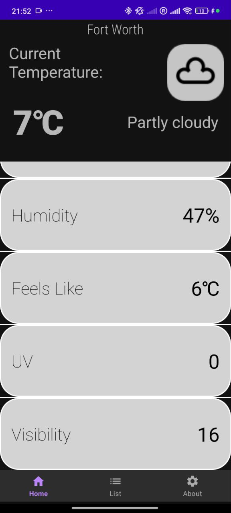
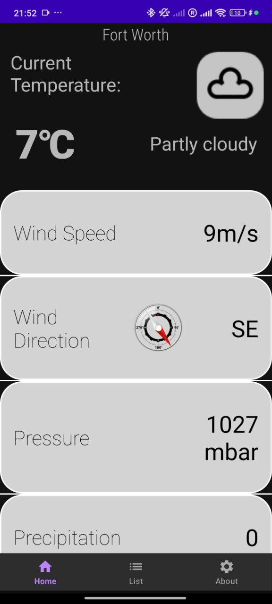
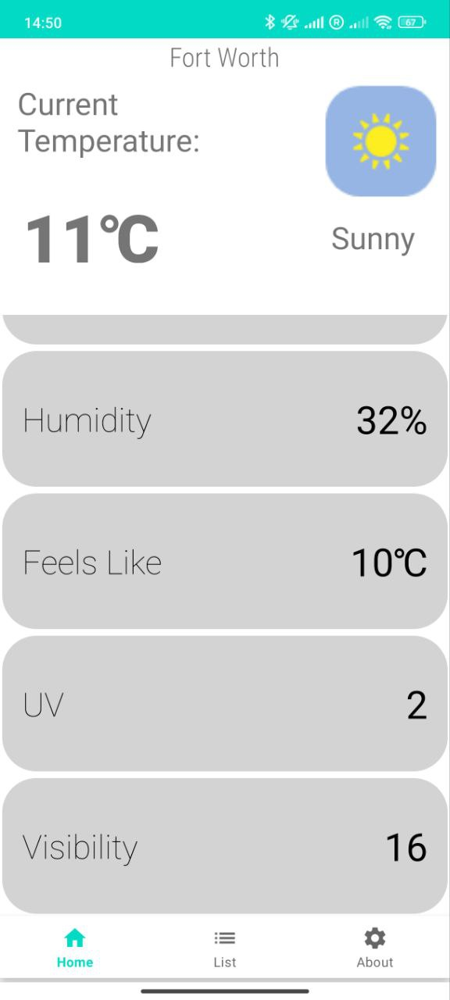
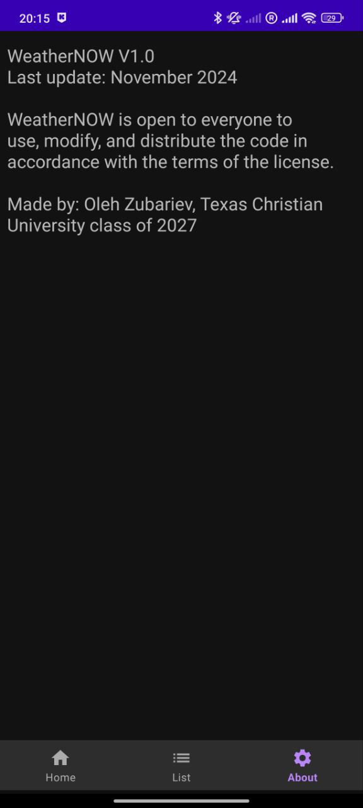

# WeatherNOW: Current Weather Conditions 

WeatherNOW is an Android application that provides real-time weather updates based on the user's location. The app displays key weather metrics such as temperature, a short description, wind speed and direction, pressure, precipitation, humidity, "feels like" temperature, UV index, and visibility. It features a wind compass with a rotating needle for wind direction (precise to one degree) and dynamic day/night visuals based on the user's local time.

---

## **Current Features**

1. **Location-Based Weather**: After a user allows the app to use location services, it will load the weather data in the user's current location
2. **Real-Time Updates**: Frequent updates via the Weatherstack API ensure accurate and up-to-date information
3. **User-Friendly Interface**: 
   - Key data like temperature and conditions are always visible at the top
   - Additional metrics are displayed in scrollable fields
   - A clean, minimalistic design ensures readability
4. **Dynamic Theme Support**: The app automatically adjusts to the phone's light or dark mode for optimal user experience

---

 &nbsp; &nbsp; &nbsp; &nbsp;  &nbsp; &nbsp; &nbsp; &nbsp;  

---

# Installation and use

**For regular use:** Navigate to the Releases Tab and download the latest version of the app. Note that the app needs an API key. Currently, it uses my own API key, but I might change my key or my subscription type, which might result in incorrect work of the app. For a better experience, you should use the other option.

**For full functionality:** Clone this repository and open it in any code redactor. In the "WeatherDataService.java" file, change the link to include your API key. The base version of the API is free and includes 100 calls per month. You can also modify any app file since it is open-source under the MIT license. 

# Technology used:

- The app is made in Android Studio
- Java is the main language used
- The app uses Weatherstack API which provides all accurate weather reports
- Volley library is used to fetch the JSON data that is received from the API
- LocationServices library is used for determining the current location

# Future updates:

While developing the app I ran into several problems, some of which remain unsolved. I would like to continue working on this app to finish some of the elements, which include:
1. Make the information stay on the screen after switching between the tiles. The ViewModel I created for this fragment did not work and I am unsure why
2. Include the city-search function to show the weather anywhere in the world. The back-end for this feature exists and is working. It can be found in the DashboardFragment.java. However, I am unable to display any of the information on the second fragment, despite all of my attempts. I am unable to make any changes to the elements that exist on that fragment
3. For the city-search function I want to include the drop-down menu with all locations, which will change depending on the entered information (like in Google Maps)
4. A switch to change units from Celsius to Fahrenheit
   
---

 &nbsp; &nbsp; &nbsp; &nbsp;  &nbsp; &nbsp; &nbsp; &nbsp; 

---

# Contact, Collaboration, and Final Thoughts:
Feel free to email me at [oleh.zubariev@tcu.edu](mailto:oleh.zubariev@tcu.edu)  with all suggestions or work on this app yourself. You can also add me on LinkedIn, which you can find in my [GitHub profile README](https://github.com/olehzu). I would also appreciate any feedback or suggestions on how to fix the issues discussed in the previous paragraph. It was my first attempt to make an Android app, and I worked on it completely alone, learning information from various web sources. It taught me a lot about web development and self-learning and I got lots of experience in working on these sorts of projects. I am planning to continue working on this app, but I am also excited to start a new project in a different field to further expand my knowledge and see what part of software development interests me the most. 
